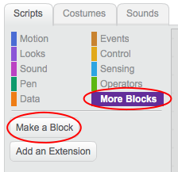
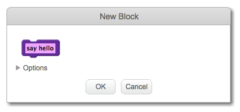

+ Click the **Scripts** tab, then on **More Blocks**, and then click **Make a Block**.

+ Give your new block a name and then click **OK**.

+ You will see a new `define` block. Attach code to this block.

+ You can then use your new block just like any normal block.

+ The code attached to your new `define` block is run whenever the block is used.

