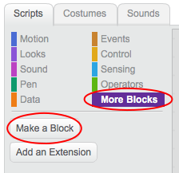
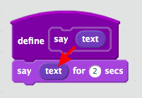

## Making a block

+ Click the **Scripts** tab, then on **More Blocks**, and then click **Make a Block**.

+ Geef uw nieuwe blok een naam en klik vervolgens op **OK**.

+ Je ziet een nieuw `definieer` blok. Attach code to this block.

+ Je kunt je nieuwe blok dan gebruiken zoals elke normale blok.

+ De code die gekoppeld is aan je nieuwe `definieer` blok wordt uitgevoerd wanneer dit blok wordt gebruikt.

#### Een blok met parameters maken

+ Je kan ook blokken maken met 'gaten' om gegevens toe te voegen. Deze 'gaten' worden 'parameters' genoemd. To add parameters, first make a new block, and then click on **Options** to choose the type of data you want to add. Geef vervolgens je gegevens een naam en klik op **OK**.

+ Je zult een nieuw `definieer` blok zien zoals gebruikelijk, behalve dat deze het door jou toegevoegde gegevensgat en de door jou gekozen naam bevat.

+ You can then use your new block, filling in data in the gap.

+ Zoals gewoonlijk wordt de code, die is gekoppeld aan je nieuwe `definieer` blok, uitgevoerd wanneer het blok wordt gebruikt.

