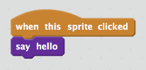

## Bir blok oluşturma

+ Click the **Scripts** tab, then on **More Blocks**, and then click **Make a Block**.

+ Yeni bloğunuza bir isim verin ve **Tamam** düğmesini tıklayın.

+ Yeni bir `tanım` bloğu göreceksiniz. Kodu bu bloğa ekleyin.

+ Artık yeni bloğunuzu, normal bloklar gibi kullanabilirsiniz.

+ Yeni `tanım` bloğunuza eklenen kod, bloğun her kullanımında çalıştırılır.

#### Değişkenli blok oluşturma

+ Sonradan veri eklemek için 'boşlukları' olan bloklar da oluşturabilirsiniz. Bu 'boşluklar', 'değişken' olarak adlandırılır. To add parameters, first make a new block, and then click on **Options** to choose the type of data you want to add. Sonra verinize bir isim verin ve **Tamam**'ı tıklayın.

+ Her zamankinden farklı olarak bu kez isim verip veri boşluğu eklediğiniz yeni bir `tanım` bloğu göreceksiniz.

+ Daha sonra bu yeni bloğunuzu, boşluğuna veri girerek kullanabilirsiniz.

+ Her zamanki gibi, yeni `tanım` bloğunuza eklenen kod, bloğun her kullanımında çalıştırılır.

